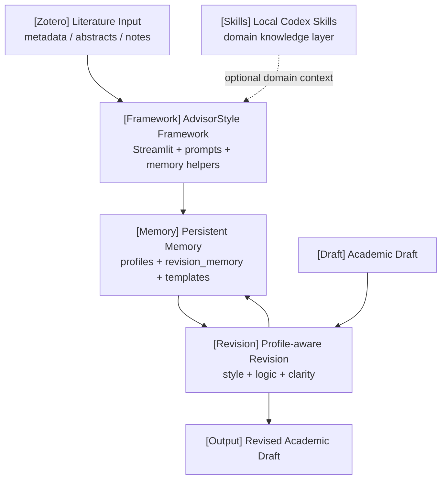

# AdvisorStyle Agent

> A persistent academic writing memory framework for supervisor-style writing,
> revision learning, and Zotero-assisted workflows.


AdvisorStyle Agent is **not a chatbot**. It is a lightweight, reusable academic
writing memory framework. The project stores persistent writing memory in local
files, then uses that memory to prepare supervisor-style academic revision
prompts.

The public GitHub repository is intentionally discipline-independent. Biology,
geology, chemistry, medicine, engineering, and other specialist knowledge should
be layered through local Codex Skills or user-provided context, not hardcoded in
this repository.

## What This Framework Does

| Memory Layer | Stored In | Purpose |
|---|---|---|
| Style memory | `profiles/*.json` | Supervisor writing style, tone, structure, and expressions |
| Revision memory | `revision_memory/*.json` | Patterns learned from original/revised draft pairs |
| Workflow memory | `templates/` | Reusable Zotero + Codex writing workflows |

```text
Zotero / pasted literature
  -> build supervisor profile
  -> update style memory
  -> learn from revisions
  -> rewrite academic drafts
  -> update long-term memory
```

## Architecture



## Core Workflows

### 1. Build Supervisor Profile

Import Zotero metadata, abstracts, notes, BibTeX, or pasted supervisor-authored
text. The framework extracts style observations and updates `profiles/*.json`.

### 2. Learn From Revisions

Compare an original draft with a revised version or supervisor-edited version.
The framework stores reusable revision patterns in `revision_memory/`.

### 3. Rewrite Academic Drafts

Select a saved supervisor profile, paste a draft, and generate a
profile-aware revision prompt. The framework preserves evidence boundaries and
does not invent sources or data.

### 4. Update Long-term Memory

Each new literature batch or revision pair updates local memory files. The
model does not become smarter by itself; the project becomes more useful because
the memory files become richer and better organized.

## Project Structure

```text
advisor-style-agent/
|-- app.py
|-- README.md
|-- requirements.txt
|-- .env.example
|-- data/
|   `-- .gitkeep
|-- llm/
|   |-- __init__.py
|   |-- profile_manager.py
|   |-- prompt_loader.py
|   |-- rewrite_engine.py
|   |-- style_analyzer.py
|   `-- zotero_input.py
|-- profiles/
|   `-- example_supervisor_profile.json
|-- revision_memory/
|   `-- .gitkeep
|-- templates/
|   |-- supervisor_profile_template.json
|   `-- workflow_memory_template.json
|-- prompts/
|   |-- draft_rewriter.md
|   |-- draft_rewriter_with_profile.md
|   |-- profile_builder.md
|   |-- profile_updater.md
|   |-- revision_memory_updater.md
|   |-- style_analyzer.md
|   `-- zotero_literature_input.md
`-- skills/
    `-- advisor-style-agent-workflow/
        |-- SKILL.md
        `-- agents/
            `-- openai.yaml
```

## Quick Start

Install dependencies:

```bash
pip install -r requirements.txt
```

Run the app:

```bash
streamlit run app.py
```

## Zotero + Codex Skills

The GitHub framework stays general-purpose. Use Zotero and local Codex Skills to
bring in external context:

```bash
python3 <plugin-root>/skills/zotero/scripts/zotero.py status --json
python3 <plugin-root>/skills/zotero/scripts/zotero.py search "supervisor name" --json
python3 <plugin-root>/skills/zotero/scripts/zotero.py export-bibtex --out references.bib
python3 <plugin-root>/skills/zotero/scripts/zotero.py citations --style apa --json
```

Local Codex Skills can add domain knowledge without changing the public repo:

| Discipline | Example Local Skill Layer | Public Repo Behavior |
|---|---|---|
| Biology | Gene/protein terminology, experimental reporting norms | Stores style and revision memory only |
| Geology | Stratigraphy, sedimentology, geochemistry conventions | Does not hardcode geology logic |
| Chemistry | Compound naming, reaction conditions, analytical methods | Uses user/skill context when supplied |
| Medicine | Clinical evidence standards, ethics constraints, reporting guidelines | Avoids domain claims without evidence |
| Engineering | Design constraints, system metrics, evaluation structure | Keeps workflow and memory generic |

## Codex Usage Examples

```text
Use this repository as a general academic memory framework. Read
profiles/example_supervisor_profile.json and prepare a profile-aware rewrite
prompt for my draft without inventing citations or data.
```

```text
Use Zotero Skill to collect metadata and abstracts for papers by my supervisor.
Then prepare input for Build Supervisor Profile. Keep domain interpretation in
my local Codex Skill, not in the public repository.
```

```text
Compare my original paragraph with this revised paragraph and update revision
memory. Extract reusable revision patterns but do not add factual claims.
```

## Included Codex Skill

This repository includes a lightweight Codex Skill for maintaining the framework:

```text
skills/advisor-style-agent-workflow/SKILL.md
```

To install or adapt it locally, copy the skill folder into your Codex skills
directory:

```text
<CODEX_HOME>/skills/advisor-style-agent-workflow/
```

## Environment Variables

The current prototype runs without API keys. For future LLM or Zotero API
integration, copy `.env.example` to `.env` and add your own keys locally.

Do not hardcode API keys in Python files, prompt files, or README examples.

```text
OPENAI_API_KEY=
DEEPSEEK_API_KEY=
ZOTERO_API_KEY=
ZOTERO_LIBRARY_ID=
ZOTERO_LIBRARY_TYPE=user
```

## Academic Integrity Rules

- Do not invent literature.
- Do not invent page numbers.
- Do not invent data, methods, results, or conclusions.
- Use supervisor profiles for writing style guidance, not factual evidence.
- Keep the GitHub repository discipline-independent.
- Put specialized knowledge in local Codex Skills or user-provided context.
- Mark uncertain or incomplete citation information clearly.

---

# 中文说明

AdvisorStyle Agent 现在定位为一个**通用学术写作记忆框架**，不是一个聊天机器人。它的核心不是让模型自己变聪明，而是持续维护本地记忆文件，例如：

```text
profiles/professor_x_profile.json
revision_memory/professor_x_revision_memory.json
templates/workflow_memory_template.json
```

公开 GitHub 仓库保持轻量、通用、跨学科。地质、生物、化学、医学、工程等专业知识应通过本地 Codex Skills 或用户提供的上下文叠加，不写死在公开仓库里。

## 中文架构

```text
Zotero 文献 / 手动粘贴文本
  -> 构建导师画像
  -> 更新 style memory
  -> 从修改稿中学习 revision memory
  -> 按保存的 profile 改写论文草稿
  -> 持续更新长期写作记忆
```

## 三层记忆

| 记忆层 | 保存位置 | 用途 |
|---|---|---|
| Style memory | `profiles/*.json` | 导师写作风格、语气、结构、常用表达 |
| Revision memory | `revision_memory/*.json` | 从原稿/改稿中学习修改规律 |
| Workflow memory | `templates/` | Zotero + Codex 写作流程模板 |

## 跨学科使用方式

这个仓库不应硬编码任何专业逻辑。不同学科通过本地 Codex Skill 叠加：

- Biology：实验设计、基因/蛋白术语、报告规范
- Geology：地层、沉积学、地球化学表达规范
- Chemistry：化合物命名、反应条件、分析方法
- Medicine：临床证据、伦理边界、报告标准
- Engineering：设计约束、评价指标、系统结构

## 运行方式

```bash
pip install -r requirements.txt
streamlit run app.py
```

## 学术规范

- 不编造文献。
- 不编造页码。
- 不编造数据、方法、实验结果或结论。
- 导师画像只作为写作风格参考，不能当作事实依据。
- 公开仓库保持通用，专业知识放在本地 Codex Skills 中。
