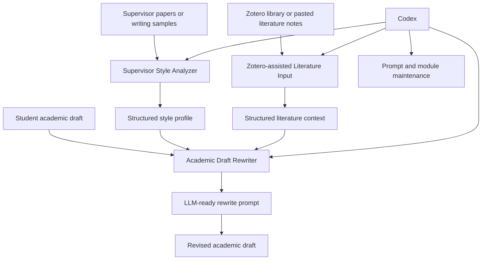
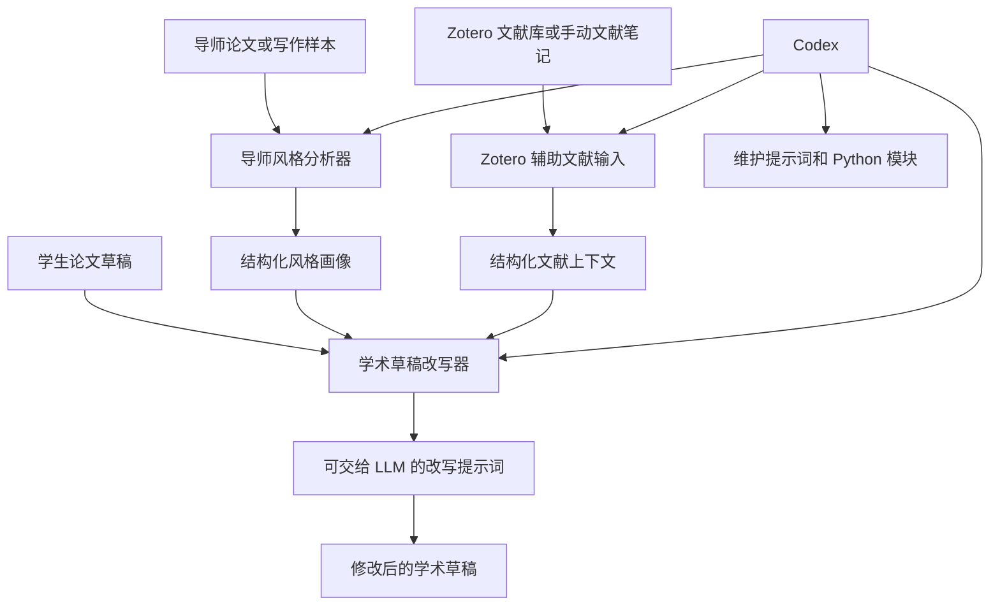

# AdvisorStyle Agent

AdvisorStyle Agent is a simple Streamlit prototype for academic writing support.
It helps users analyze a supervisor's academic writing style, prepare draft
rewriting prompts, and organize literature notes for future Zotero integration.

The project is intentionally beginner-friendly. It can run without an API key:
the current version builds structured prompts first, then leaves room for later
OpenAI, DeepSeek, Zotero Skill, or Zotero API integration.

## Core Modules

### 1. Supervisor Style Analyzer

Paste representative writing from a supervisor or target academic author. The
app prepares a structured prompt for extracting:

- tone and academic stance
- sentence-level patterns
- paragraph and argument structure
- evidence and citation habits
- reusable style rules for rewriting

### 2. Academic Draft Rewriter

Paste a student draft and, optionally, a style profile from the analyzer. The
app prepares a rewrite prompt that asks an LLM to:

- preserve the original scientific meaning
- improve clarity and academic tone
- follow the supervisor-style profile where appropriate
- flag unsupported claims instead of inventing evidence

### 3. Zotero-assisted Literature Input

Paste citation notes, BibTeX snippets, or Zotero item summaries. The app turns
them into a structured literature map that is ready for future Zotero Skill or
Zotero API integration.

## Workflow Diagram



## Typical User Workflow

1. Paste one or more supervisor writing samples into **Supervisor Style Analyzer**.
2. Generate a style profile and review what is observed versus inferred.
3. Paste a student draft into **Academic Draft Rewriter**.
4. Add the style profile and select a rewrite goal.
5. Paste citation notes or Zotero item summaries into **Zotero-assisted Literature Input**.
6. Use the generated literature context to support the rewrite prompt.
7. Send the final prompt to an LLM provider when API integration is added.

## Zotero Skill Usage Examples

The current app accepts manual literature input. When the Zotero Skill is
available in Codex, it can help retrieve local Zotero records and prepare the
input for the third module.

Check whether Zotero Desktop and the local API are ready:

```bash
python3 <plugin-root>/skills/zotero/scripts/zotero.py status --json
```

Enable the local API if needed:

```bash
python3 <plugin-root>/skills/zotero/scripts/zotero.py enable --restart
```

Search the local Zotero library:

```bash
python3 <plugin-root>/skills/zotero/scripts/zotero.py search "Longtan Formation" --json
```

Export references to BibTeX:

```bash
python3 <plugin-root>/skills/zotero/scripts/zotero.py export-bibtex --out references.bib
```

Insert a citation into a Markdown draft and update the BibTeX file:

```bash
python3 <plugin-root>/skills/zotero/scripts/zotero.py cite --query "Longtan Formation" --markdown draft.md --bib references.bib --marker "<cite>"
```

In this project, Zotero output should be converted into a structured literature
map before it is used for rewriting. A good literature note looks like this:

```text
- Citation key: smith_longtan_2024
- Main finding: ...
- Evidence type: field section, petrography, geochemistry, or synthesis
- Relevance to draft: supports the discussion of ...
- Caution: limited study area; do not overgeneralize
```

## Project Structure

```text
advisor-style-agent/
|-- app.py
|-- README.md
|-- requirements.txt
|-- .env.example
|-- data/
|   `-- .gitkeep
|-- llm/
|   |-- __init__.py
|   |-- prompt_loader.py
|   |-- rewrite_engine.py
|   |-- style_analyzer.py
|   `-- zotero_input.py
`-- prompts/
    |-- draft_rewriter.md
    |-- style_analyzer.md
    `-- zotero_literature_input.md
```

## Quick Start

Install dependencies:

```bash
pip install -r requirements.txt
```

Run the app:

```bash
streamlit run app.py
```

## Environment Variables

The current prototype runs without API keys. For future LLM or Zotero
integration, copy `.env.example` to `.env` and add your own keys locally.

Do not hardcode API keys in Python files, prompt files, or README examples.

```text
OPENAI_API_KEY=
DEEPSEEK_API_KEY=
ZOTERO_API_KEY=
ZOTERO_LIBRARY_ID=
ZOTERO_LIBRARY_TYPE=user
```

## How It Works with Codex

Codex can help maintain and extend this project by:

- editing Streamlit UI and Python modules
- improving prompt templates in `prompts/`
- adding LLM provider calls inside `llm/`
- keeping academic integrity rules visible in every prompt
- preparing future Zotero workflows without uploading unpublished data

A typical Codex development workflow is:

1. Improve or add a prompt template.
2. Add a small Python helper in `llm/`.
3. Connect the helper to a Streamlit module in `app.py`.
4. Test the app with `streamlit run app.py`.

## How It Can Work with Zotero Later

The current Zotero module accepts pasted notes manually. A future version can
replace this manual input with:

- Zotero Skill search results
- Zotero local API records
- BibTeX exports
- selected items from a Zotero collection

The important design rule is that Zotero records should become structured
literature context first. The rewrite module should use that context to support
claims, but it must not invent references, page numbers, data, or conclusions.

## Academic Integrity Rules

This project is designed for rigorous academic writing support:

- Do not invent literature.
- Do not invent page numbers.
- Do not invent data, methods, results, or conclusions.
- Separate observed writing features from inferred style preferences.
- Mark uncertain or incomplete citation information clearly.

## Future Improvements

- Add real LLM calls behind the prompt-building functions.
- Add Zotero Skill or Zotero API lookup.
- Export style profiles and rewrite prompts to files.
- Add tests for prompt rendering.
- Support multiple supervisor profiles.

---

# 中文说明

AdvisorStyle Agent 是一个面向学术写作的 Streamlit 原型工具。它的目标是帮助用户分析导师或目标作者的学术写作风格，并把这种风格转化为可复用的改写提示词；同时，它也为后续接入 Zotero Skill 或 Zotero API 做准备。

当前版本不需要 API key。它不会直接调用外部大模型，而是先生成结构化提示词，便于后续接入 OpenAI、DeepSeek 或其他 LLM 服务。

## 核心模块

### 1. 导师风格分析器

用户可以粘贴导师论文、摘要、引言、讨论部分或其他代表性文本。系统会生成一个结构化风格分析提示词，用来提取：

- 学术语气与表达立场
- 句式和段落组织习惯
- 论证结构
- 证据和引用使用习惯
- 后续改写时应遵循的风格规则

### 2. 学术草稿改写器

用户可以粘贴自己的论文草稿，并选择性加入第一步生成的风格画像。系统会生成一个改写提示词，要求大模型在后续接入时：

- 保留原始科学含义
- 提升学术表达、逻辑和清晰度
- 尽量贴近导师或目标作者的写作风格
- 标出缺少引用或证据支持的表述，而不是编造文献或数据

### 3. Zotero 辅助文献输入

当前版本支持手动粘贴文献笔记、BibTeX 片段或 Zotero 条目摘要。系统会把这些内容整理为结构化文献上下文，供后续改写模块使用。

未来可以把手动输入替换为：

- Zotero Skill 搜索结果
- Zotero 本地 API 记录
- BibTeX 导出文件
- Zotero 某个 collection 中选中的文献

## 中文工作流



## Zotero Skill 使用示例

检查 Zotero Desktop 和本地 API 是否可用：

```bash
python3 <plugin-root>/skills/zotero/scripts/zotero.py status --json
```

搜索本地 Zotero 文献库：

```bash
python3 <plugin-root>/skills/zotero/scripts/zotero.py search "Longtan Formation" --json
```

导出 BibTeX：

```bash
python3 <plugin-root>/skills/zotero/scripts/zotero.py export-bibtex --out references.bib
```

把引用插入 Markdown 草稿：

```bash
python3 <plugin-root>/skills/zotero/scripts/zotero.py cite --query "Longtan Formation" --markdown draft.md --bib references.bib --marker "<cite>"
```

在本项目中，Zotero 的输出最好先整理为结构化文献上下文，再交给改写模块使用。推荐格式如下：

```text
- Citation key: smith_longtan_2024
- Main finding: ...
- Evidence type: field section, petrography, geochemistry, or synthesis
- Relevance to draft: supports the discussion of ...
- Caution: limited study area; do not overgeneralize
```

## 运行方式

安装依赖：

```bash
pip install -r requirements.txt
```

启动应用：

```bash
streamlit run app.py
```

## 学术规范

本项目必须遵守以下原则：

- 不编造文献。
- 不编造页码。
- 不编造数据、方法、实验结果或结论。
- 区分文本中直接观察到的写作特征和推断出的风格偏好。
- 对不确定或不完整的文献信息进行明确标注。
