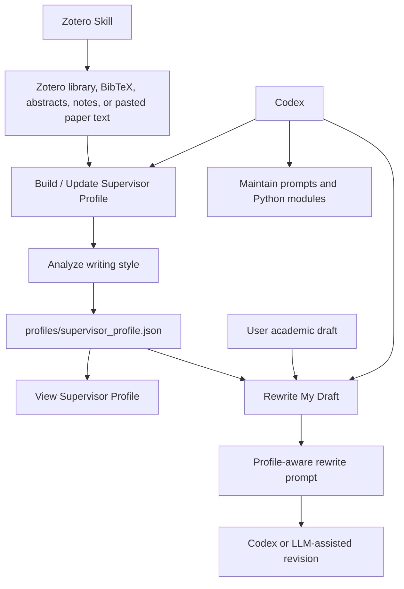
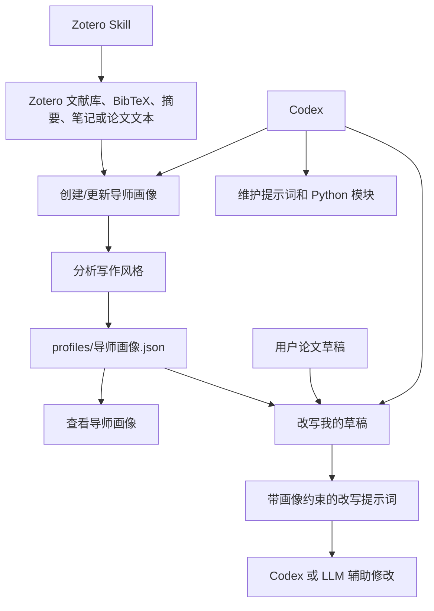

# AdvisorStyle Agent

AdvisorStyle Agent is a beginner-friendly Streamlit app for long-term
supervisor-style academic writing support. The project helps users collect
writing samples from one supervisor, build a local supervisor style profile,
update that profile over time, and use it to prepare profile-aware academic
rewrite prompts inside Codex.

The app runs without API keys. It saves local JSON profiles and prepares
structured prompts that can later be connected to OpenAI, DeepSeek, Zotero
Skill, or the Zotero API.

## Long-term Vision

The goal is to create a small, local writing assistant that grows with the
user's research workflow:

1. Use Zotero Skill, Zotero API, BibTeX exports, notes, abstracts, or pasted
   paper text to collect one supervisor's writing samples.
2. Analyze writing style features, common expressions, structure preferences,
   tone, and revision rules.
3. Save those observations as a reusable supervisor profile in `profiles/`.
4. Use the saved profile to polish, revise, and improve academic drafts in a
   style that is closer to the target supervisor while preserving academic
   integrity.

## Streamlit Tabs

### 1. Build / Update Supervisor Profile

Paste Zotero metadata, abstracts, notes, or paper text from one supervisor. The
app updates a local JSON profile and prepares profile-builder/profile-updater
prompts.

### 2. View Supervisor Profile

Open a saved profile from `profiles/`, inspect its JSON fields, and copy it for
use in Codex or another LLM workflow.

### 3. Rewrite My Draft

Select a saved supervisor profile, paste a draft, and generate a profile-aware
rewriting prompt.

### 4. Zotero Workflow Guide

Read simple Zotero Skill commands and a safe workflow for converting Zotero
records into local literature context.

## Workflow Diagram



## Supervisor Profile Format

Each supervisor has a local JSON profile in `profiles/`. A profile stores:

- writing style features
- common expressions
- structure preferences
- tone and stance
- revision rules
- Zotero or literature source summaries
- notes and uncertainty

An example file is included:

```text
profiles/example_supervisor_profile.json
```

## Project Structure

```text
advisor-style-agent/
|-- app.py
|-- README.md
|-- requirements.txt
|-- .env.example
|-- data/
|   `-- .gitkeep
|-- llm/
|   |-- __init__.py
|   |-- profile_manager.py
|   |-- prompt_loader.py
|   |-- rewrite_engine.py
|   |-- style_analyzer.py
|   `-- zotero_input.py
|-- profiles/
|   `-- example_supervisor_profile.json
`-- prompts/
    |-- draft_rewriter.md
    |-- draft_rewriter_with_profile.md
    |-- profile_builder.md
    |-- profile_updater.md
    |-- style_analyzer.md
    `-- zotero_literature_input.md
```

## Quick Start

Install dependencies:

```bash
pip install -r requirements.txt
```

Run the app:

```bash
streamlit run app.py
```

## Environment Variables

The current prototype runs without API keys. For future LLM or Zotero
integration, copy `.env.example` to `.env` and add your own keys locally.

Do not hardcode API keys in Python files, prompt files, or README examples.

```text
OPENAI_API_KEY=
DEEPSEEK_API_KEY=
ZOTERO_API_KEY=
ZOTERO_LIBRARY_ID=
ZOTERO_LIBRARY_TYPE=user
```

## Codex + Zotero Workflow

Codex can maintain this project and help use it as part of an academic writing
workflow:

1. Use Zotero Skill to search or export supervisor literature.
2. Paste the cleaned Zotero output into the Streamlit profile builder.
3. Save or update a profile in `profiles/`.
4. Ask Codex to inspect the profile and revise prompt templates.
5. Use the saved profile to generate draft-rewriting prompts.
6. Keep all unpublished data local unless you explicitly decide it can be
   shared with an external service.

## Zotero Skill Examples

Check whether Zotero Desktop and the local API are ready:

```bash
python3 <plugin-root>/skills/zotero/scripts/zotero.py status --json
```

Enable the local API if needed:

```bash
python3 <plugin-root>/skills/zotero/scripts/zotero.py enable --restart
```

Search one supervisor's papers:

```bash
python3 <plugin-root>/skills/zotero/scripts/zotero.py search "supervisor name" --json
```

Export BibTeX:

```bash
python3 <plugin-root>/skills/zotero/scripts/zotero.py export-bibtex --out references.bib
```

List citation-style records:

```bash
python3 <plugin-root>/skills/zotero/scripts/zotero.py citations --style apa --json
```

Insert a citation into a Markdown draft and update the BibTeX file:

```bash
python3 <plugin-root>/skills/zotero/scripts/zotero.py cite --query "Longtan Formation" --markdown draft.md --bib references.bib --marker "<cite>"
```

## Example Commands in Codex

Ask Codex to use the project like this:

```text
Read profiles/example_supervisor_profile.json and help me rewrite this paragraph
using the saved supervisor style profile. Do not invent citations or data.
```

```text
Use Zotero Skill to search my local library for papers by [supervisor name],
summarize the metadata and abstracts, and prepare input for the profile builder.
```

```text
Update prompts/profile_updater.md so the profile separates observed style
features from uncertain inferences more clearly.
```

## Academic Integrity Rules

This project is designed for rigorous academic writing support:

- Do not invent literature.
- Do not invent page numbers.
- Do not invent data, methods, results, or conclusions.
- Use supervisor profiles for style guidance, not factual evidence.
- Separate observed writing features from inferred style preferences.
- Mark uncertain or incomplete citation information clearly.

## Future Improvements

- Add real LLM calls behind the prompt-building functions.
- Add direct Zotero API lookup.
- Export profile update reports.
- Add tests for profile loading and prompt rendering.
- Support multiple profiles and profile comparison.

---

# 中文说明

AdvisorStyle Agent 是一个面向长期学术写作训练的 Streamlit 小工具。它的目标不是一次性润色文本，而是帮助用户持续积累某位导师或目标作者的写作风格画像，并在 Codex 中用这个画像辅助论文草稿修改。

当前版本不需要 API key。系统会把导师风格画像保存在本地 `profiles/` 文件夹中，并生成可交给 LLM 的结构化提示词。

## 长期目标

理想工作流是：

1. 用 Zotero Skill、Zotero API、BibTeX、摘要、笔记或手动粘贴的论文文本收集某位导师的写作样本。
2. 分析写作风格、常用表达、结构偏好、语气和修改规则。
3. 把这些信息保存为本地 JSON 风格画像。
4. 后续写论文时，调用这个画像来润色、修改和优化自己的学术草稿。

## 四个界面标签

### 1. Build / Update Supervisor Profile

用于创建或更新导师风格画像。输入可以是 Zotero 文献元数据、摘要、笔记或论文文本。

### 2. View Supervisor Profile

查看已经保存在 `profiles/` 中的导师画像。

### 3. Rewrite My Draft

选择一个导师画像，粘贴自己的论文草稿，生成带有导师风格约束的改写提示词。

### 4. Zotero Workflow Guide

查看 Zotero Skill 的基本命令，以及如何把 Zotero 文献整理成可用于画像更新的输入。

## 中文工作流图



## 运行方式

安装依赖：

```bash
pip install -r requirements.txt
```

启动应用：

```bash
streamlit run app.py
```

## 学术规范

本项目必须遵守以下原则：

- 不编造文献。
- 不编造页码。
- 不编造数据、方法、实验结果或结论。
- 导师画像只能作为写作风格参考，不能当作事实依据。
- 区分文本中直接观察到的写作特征和推断出的风格偏好。
- 对不确定或不完整的文献信息进行明确标注。
